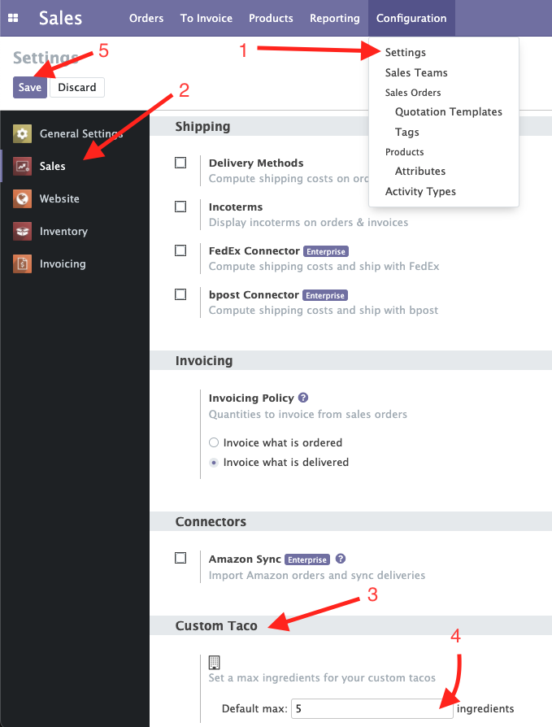
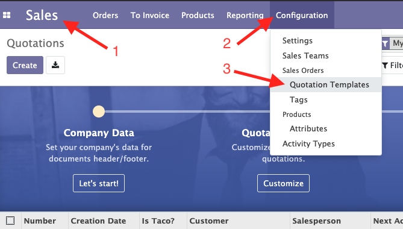
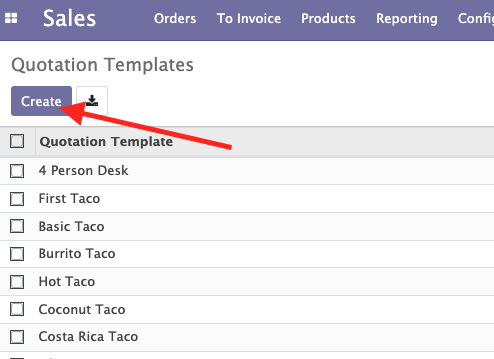
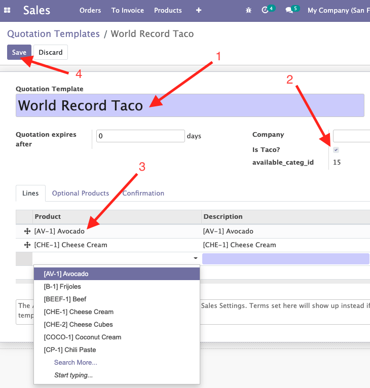
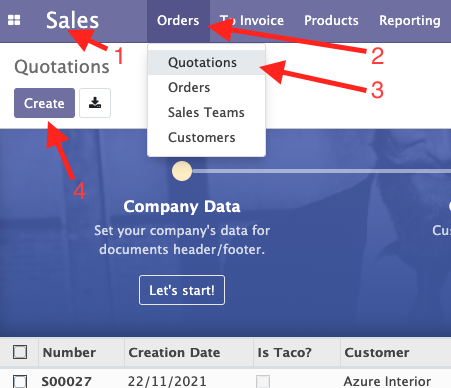
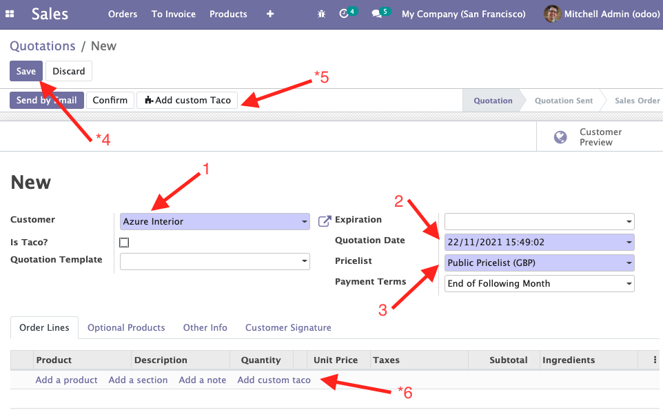
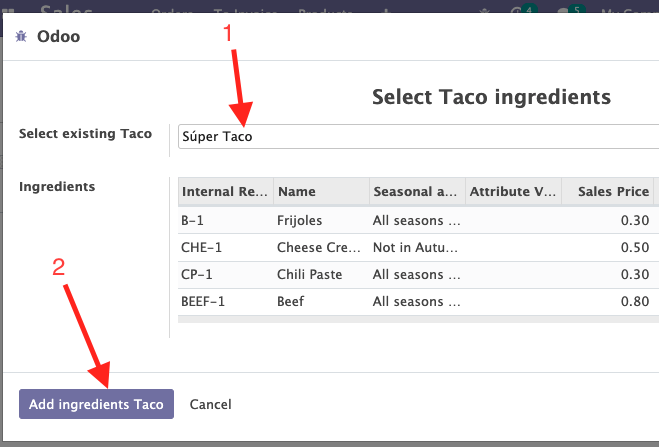
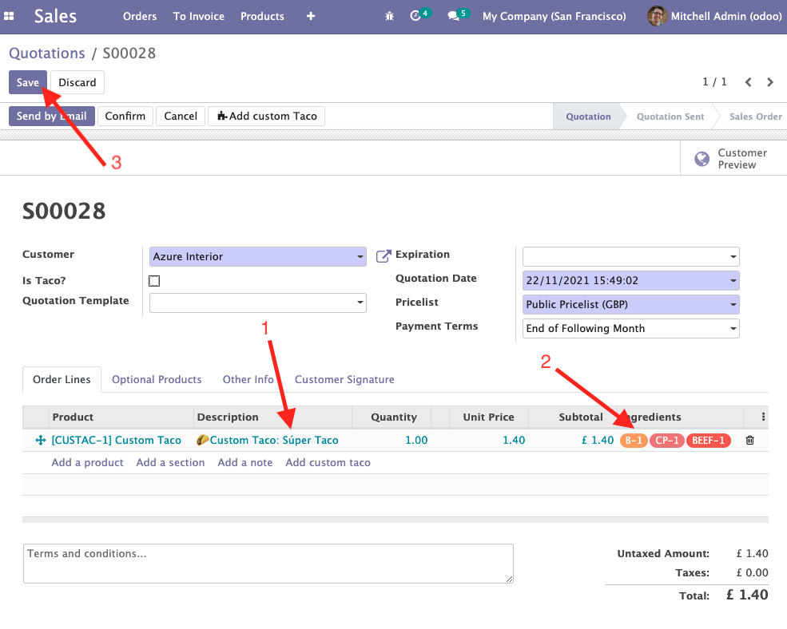
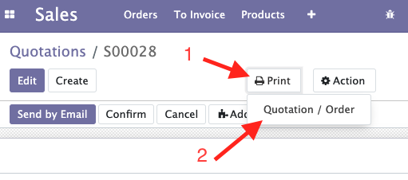
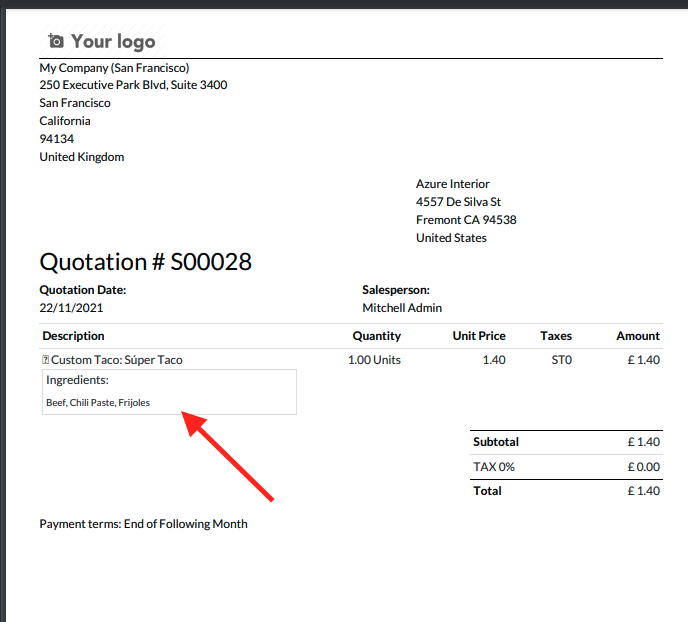

# training Chapter 11

## Instructions

**Explanation** These are the steps to follow to configure a Taco.

## Step 01

1. Open the Sales options and go to Configuration > Settings
2. If you are not in Sales options you can choose here
3. Go to te bottom and on the "Custom Taco" section
4. Put the max ingredients
5. Save the data to keep changes

    

## Step 02

Then you can configure some custm tacos

1. Open the Sales
2. Click on Configuration
2. Go to Configuration > Quotation Templates

    

## Step 03

You are going to create a Quotation template
### Step 03 - 01

1. Pres Create Button

    

### Step 03 - 02

1. Put the name of your new custom taco
2. Check the "Is Taco?" flag
3. Select the ingredients
4. Save your new template

    

## Step 04

Let's order a Custom Taco

1. Go Sales
2. Click Orders
3. Select Quotations
4. Press Create button

    

### Step 04 - 01

Creating the Custom Taco

1. Select Customer (is mandatory)
2. Select the date (needed to calculate the season)
3. Select the pricelist
4. \* It is absolutely necessary to save the order before to be able to access the wizard
5. \* Click on the Wizar launcher (This is not exactly the requirement)
6. \* This functionality is not working properly

(\*) Unfortunately I have not been able to solve this part of the training

    

### Step 04 - 02

The Wizard

1. Select the custom taco template (then you will see the ingredients below)
2. Click on the "Add ingredients Taco" to send these ingredients to the order

    

## Step 05

The order receive the custom taco like a new line

1. Check that the selected Taco is in a new order line
2. Checl that the ingredients match with the season
3. If all is ok then you can Save the order

    

## Step 06

Print the Order
1. Go to the Print Action button
2. Press Quotation / Order

    

## Step 07

Now you can see the ingredientes below the Taco Line

    

